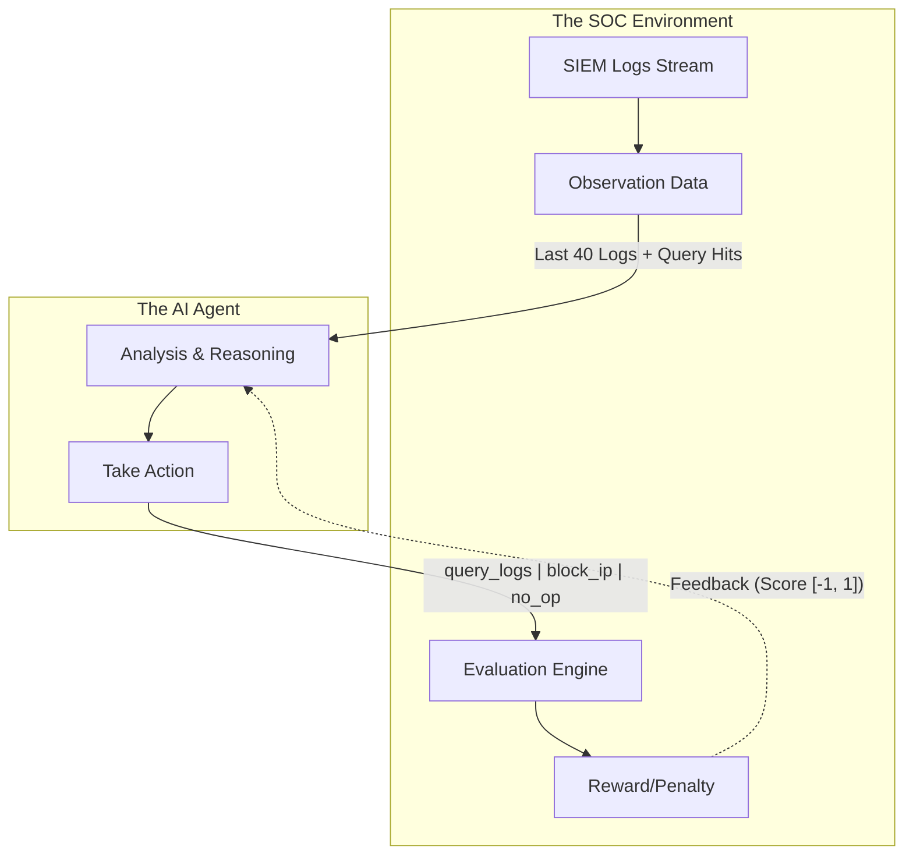

# 🛡️ Network Incident Response Environment

[](https://www.python.org/)
[](https://github.com/openenv)
[](https://fastapi.tiangolo.com/)
[](https://www.docker.com/)

**Version:** 1.0.0 | **Status:** Production Ready

The Network Incident Response Environment is an OpenEnv-compatible benchmark designed for real incident-response work. It acts as a comprehensive training and testing ground where AI agents detect and respond to realistic network attacks by analyzing SIEM log streams and executing defensive actions.

---

## 🔗 Live Links & Deployments

* 🐳 **Docker Hub:** `docker pull normie69k/network-incident-response-env`
* 🤗 **Hugging Face Space:** Tagged with `openenv` and structured for Docker-based deployment
* **Hugging Face Deployment link** - https://normie69k-network-incident-response-env.hf.space/

---

## 📋 Table of Contents

1. [Executive Summary & Vision](#1-executive-summary--vision)
2. [Technical Architecture & RL Loop](#2-technical-architecture--rl-loop)
3. [Installation & Setup (Docker & Manual)](#3-installation--setup-docker--manual)
4. [Component Deep Dive](#4-component-deep-dive)
5. [Detailed Task Workflows](#5-detailed-task-workflows)
6. [Reward System & Scoring](#6-reward-system--scoring)
7. [License](#7-license)

---

## 1. Executive Summary & Vision

**The Vision:** To provide a robust, standardized Gym-style environment that accurately measures an AI agent's capability to operate as a Security Operations Center (SOC) analyst.

### 🛑 The Problems Solved
1.  **Unrealistic Benchmarks:** Many security AI tests are static Q&A. **Solution:** A sequential decision-making environment tracking state changes up to 20 steps.
2.  **Collateral Damage Ignorance:** Agents often blindly block IPs. **Solution:** Heavy negative scoring (-0.50) for blocking legitimate internal hosts, enforcing cautious investigation.
3.  **Complex Attack Chains:** Single-vector attacks are rare. **Solution:** Multi-stage APT simulations involving SQLi, web-server compromise, and database pivoting.

---

## 2. Technical Architecture & RL Loop

The environment relies on typed Pydantic models to strictly structure the observations, actions, and rewards for the agent.

### 🏗️ The Observation-Action Loop
The agent continuously receives network logs and must decide whether to query further, block a threat, or wait.



---

## 3. Installation & Setup (Docker & Manual)

### 🚀 3.1 Automated Deployment (Docker)
The fastest way to spin up the local server and run the simulation.

**1. Pull and Run the Published Image:**
```bash
docker pull normie69k/network-incident-response-env
docker run --rm -p 7860:7860 --env-file .env normie69k/network-incident-response-env
```
*(Source:)*

### ⚙️ 3.2 Manual Native Setup (Developers)
Requires Python >= 3.11.

```bash
# 1. Initialize Virtual Environment
python3.11 -m venv venv
source venv/bin/activate

# 2. Install Dependencies
python3.11 -m pip install --upgrade pip
python3.11 -m pip install -r requirements.txt

# 3. Configure Environment
cp .env.example .env
```
Ensure `HF_TOKEN`, `API_BASE_URL`, and `MODEL_NAME` are set in your `.env`.

---

## 4. Component Deep Dive

### 🛡️ 1. The Environment Core (`network_incident_env.py`)
Provides standard `reset()`, `step()`, and `state()` methods.
* **Observation Space:** Provides the `recent_logs` (last 40 entries), `query_results` (up to 10 entries), `blocked_ips`, and `time_elapsed`.
* **Action Space:** Enforces typed actions: `query_logs` (filters by IP/port/keyword), `block_ip`, and `no_op`.

### 🚀 2. The Deterministic Graders (`graders.py`)
Evaluates the agent's performance, outputting a final normalized score in `[0.0, 1.0]`. The scoring metric aggregates the mean graded score across tasks.

---

## 5. Detailed Task Workflows

The environment ships with three dynamically generated scenarios:

* 🟢 **Easy (`ssh_bruteforce`):** Identify and block an SSH brute-force attacker hidden among legitimate login traffic.
* 🟡 **Medium (`stealth_scan`):** Detect a slow TCP port-scan buried in high-volume HTTP/HTTPS traffic without blocking legitimate users.
* 🔴 **Hard (`lateral_movement`):** Correlate a multi-stage APT attack (SQLi → web-server compromise → DB pivot) and isolate the compromised host before data exfiltration.

---

## 6. Reward System & Scoring

The environment provides rich, incremental feedback throughout the trajectory to guide RL algorithms or prompt-based reasoning:

| Action | Outcome | Reward Increment |
| :--- | :--- | :--- |
| **`block_ip`** | Correctly blocking the attacker or pivot host | `+1.00` |
| **`block_ip`** | Blocking a legitimate internal host (Collateral) | `-0.50` |
| **`query_logs`** | First query directly identifying attacker IP | `+0.10` |
| **`query_logs`** | Surfacing suspicious/warning logs | `+0.03` |
| **`query_logs`** | Query returns benign context | `+0.01` |
| **`query_logs`** | Empty or useless query returned | `-0.02` |
| **`block_ip`** | Duplicate or irrelevant IP block | `-0.05` |
| **`no_op`** | Repeated idle loops | `-0.01` |

*(Note: The episode automatically ends when the threat is successfully neutralized or the max limit of 20 steps is reached)*

---