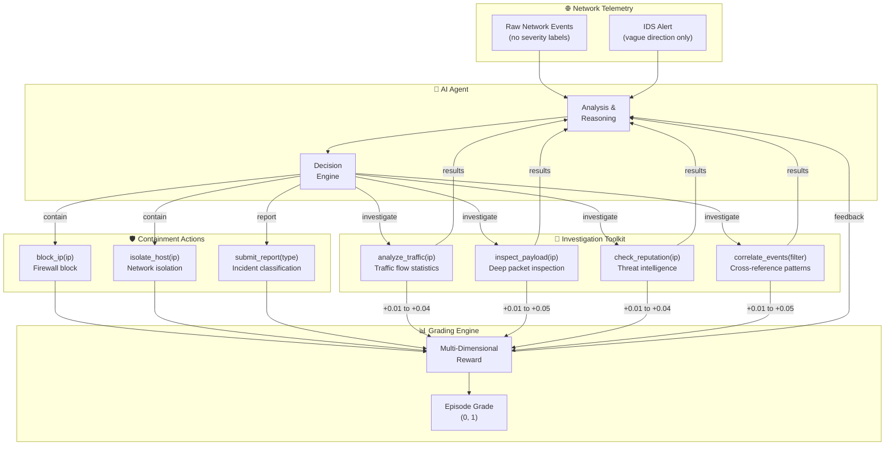

# 🛡️ Network Incident Response Environment

[](https://www.python.org/)
[](https://github.com/meta-pytorch/OpenEnv)
[](https://fastapi.tiangolo.com/)
[](https://www.docker.com/)

**Version:** 2.0.0 | **Status:** Production Ready

The Network Incident Response Environment is an OpenEnv-compatible RL benchmark that trains AI agents to operate as Security Operations Center (SOC) analysts. Agents investigate network security incidents using a 7-tool investigation toolkit, reason about raw network telemetry with **no pre-labelled severity data**, and take containment actions under time pressure across five distinct attack scenarios.

---

## 🔗 Live Links & Deployments

* 🐳 **Docker Hub:** `docker pull normie69k/network-incident-response-env`
* 🤗 **Hugging Face Space:** Tagged with `openenv` and structured for Docker-based deployment
* **Hugging Face Deployment link** - https://normie69k-network-incident-response-env.hf.space/

---

## 📋 Table of Contents

1. [Executive Summary & Vision](#1-executive-summary--vision)
2. [Technical Architecture & RL Loop](#2-technical-architecture--rl-loop)
3. [Installation & Setup (Docker & Manual)](#3-installation--setup-docker--manual)
4. [Component Deep Dive](#4-component-deep-dive)
5. [Detailed Task Workflows](#5-detailed-task-workflows)
6. [Reward System & Scoring](#6-reward-system--scoring)
7. [Multi-Dimensional Grading](#7-multi-dimensional-grading)
8. [License](#8-license)

---

## 1. Executive Summary & Vision

**The Vision:** To provide a robust, investigation-driven Gym-style environment that accurately measures an AI agent's capability to operate as a SOC analyst — rewarding methodical investigation over blind guessing.

### 🛑 The Problems Solved
1.  **Pre-Labelled Data Leaks:** Many security benchmarks give away the answer via severity labels. **Solution:** Raw network telemetry with zero severity hints — the agent must infer threats from traffic patterns, payload content, and timing.
2.  **Trivial Action Spaces:** Simple block/no-op actions don't require investigation. **Solution:** A 7-tool SOC toolkit (traffic analysis, payload inspection, threat intel, event correlation, block, isolate, report) that rewards thorough investigation before containment.
3.  **Flat Grading:** Binary pass/fail scoring misses nuance. **Solution:** Multi-dimensional continuous grading across neutralization, speed, investigation quality, and collateral avoidance with task-specific weight profiles.
4.  **Homogeneous Tasks:** Scenarios that reduce to the same pattern aren't useful for RL. **Solution:** Five qualitatively distinct attack scenarios requiring genuinely different investigation strategies — from SSH brute force to ransomware C2 beaconing.

---

## 2. Technical Architecture & RL Loop

The environment relies on typed Pydantic v2 models to strictly structure the observations, actions, and rewards. The agent interacts through an investigation-then-containment loop.

### 🏗️ The Investigation-Action Loop
The agent receives raw network events and must actively investigate before taking irreversible containment actions.



---

## 3. Installation & Setup (Docker & Manual)

### 🚀 3.1 Automated Deployment (Docker)
The fastest way to spin up the local server and run the simulation.

**1. Pull and Run the Published Image:**
```bash
docker pull normie69k/network-incident-response-env
docker run --rm -p 7860:7860 --env-file .env normie69k/network-incident-response-env
```

**2. Build from Source:**
```bash
docker build -t network-incident-response:latest .
docker run --rm -p 7860:7860 network-incident-response:latest
```

### ⚙️ 3.2 Manual Native Setup (Developers)
Requires Python >= 3.11.

```bash
# 1. Initialize Virtual Environment
python3.11 -m venv venv
source venv/bin/activate

# 2. Install Dependencies
python3.11 -m pip install --upgrade pip
python3.11 -m pip install -r requirements.txt

# 3. Configure Environment
cp .env.example .env
```
Ensure `HF_TOKEN`, `API_BASE_URL`, and `MODEL_NAME` are set in your `.env`.

### ✅ 3.3 Run Tests
```bash
python test_local.py
# 58/58 passed — All good — ready to deploy 🚀
```

---

## 4. Component Deep Dive

### 🛡️ 1. The Environment Core (`network_incident_env.py`)
Provides standard `reset()`, `step()`, `episode_summary()`, and `state()` methods.
* **Observation Space:** Provides `network_events` (last 50 raw entries — no severity), `analysis_result` (from investigation actions), `blocked_ips`, `isolated_hosts`, `time_elapsed`, `time_remaining`, and a vague `alert_summary`.
* **Action Space:** 7 typed actions enforced via Pydantic validation — `analyze_traffic`, `inspect_payload`, `check_reputation`, `correlate_events`, `block_ip`, `isolate_host`, `submit_report`.
* **Investigation Tracking:** Tracks unique IPs investigated, investigation action count, and awards a +0.10 bonus on correct containment when the agent investigates ≥2 distinct IPs first.

### 🎯 2. The Scenario Engine (`scenarios.py`)
Five attack scenarios generate raw `NetworkEvent` objects with NO severity hints. Each scenario provides investigation helpers (`get_traffic_analysis`, `get_payload_inspection`, `get_reputation`, `get_event_correlation`) that return structured results revealing attack patterns to agents that actively investigate.

### 📊 3. The Multi-Dimensional Graders (`graders.py`)
Evaluates performance across four dimensions with task-specific weight profiles, outputting a continuous score strictly within `(0.0001, 0.9999)`. See [Section 7](#7-multi-dimensional-grading) for details.

### 🔌 4. The FastAPI Server (`app.py`)
OpenEnv-compliant REST API:

| Endpoint | Method | Description |
| :--- | :--- | :--- |
| `/health` | GET | Health check |
| `/tasks` | GET | List all 5 available tasks |
| `/reset` | POST | Start a new episode `{task_id, seed}` |
| `/step` | POST | Execute an action |
| `/state` | GET | Current environment state |
| `/summary` | GET | Episode summary with graded score |
| `/grade_breakdown` | GET | Detailed 4-dimension score breakdown |

---

## 5. Detailed Task Workflows

The environment ships with five dynamically generated scenarios requiring genuinely different investigation strategies:

* 🟢 **Easy (`ssh_bruteforce`):** Detect rapid SSH login attempts from an external IP hidden in legitimate SSH traffic. The agent must identify the high-frequency pattern without any severity hints.
* 🟡 **Medium (`port_scan`):** Spot a stealthy SYN port scan probing uncommon ports across multiple internal hosts — only one probe every 2 steps, buried in heavy web traffic.
* 🟡 **Medium (`data_exfiltration`):** Identify a compromised internal host exfiltrating data via DNS tunnelling with oversized, hex-encoded DNS queries. Requires isolating the compromised host.
* 🔴 **Hard (`lateral_movement`):** Correlate a multi-stage APT attack (SQLi → web-server compromise → database pivot) and isolate the compromised pivot host before data exfiltration completes.
* 🔴 **Hard (`ransomware_c2`):** Detect a compromised host beaconing to a C2 server with periodic, uniform-size HTTPS requests while encrypting local files via SMB. Requires both blocking C2 and isolating the host.

---

## 6. Reward System & Scoring

The environment provides rich, incremental feedback throughout the trajectory. **Investigation actions give small positive rewards; containment actions are high-stakes.**

| Action | Outcome | Reward |
| :--- | :--- | :--- |
| **`analyze_traffic`** | Attacker/compromised IP traffic stats | `+0.04` |
| **`analyze_traffic`** | Legitimate IP traffic stats | `+0.01` |
| **`inspect_payload`** | Attack signatures found | `+0.05` |
| **`check_reputation`** | Threat score > 0.5 returned | `+0.04` |
| **`correlate_events`** | Attack pattern matched | `+0.05` |
| **`block_ip`** | Correctly blocking the attacker | `+0.90` / `+1.00` ★ |
| **`block_ip`** | Blocking a legitimate IP (Collateral) | `-0.40` |
| **`isolate_host`** | Isolating compromised host | `+0.90` / `+1.00` ★ |
| **`isolate_host`** | Isolating a clean host (Collateral) | `-0.40` |
| **`submit_report`** | Correct attack type classification | `+0.15` |
| **`submit_report`** | Wrong attack type classification | `-0.10` |
| **Re-investigation** | Same IP investigated again | `+0.005` (diminishing) |
| **Duplicate block** | IP already blocked/isolated | `-0.03` |

★ **Investigation Bonus:** `+0.10` added when the agent investigated ≥2 unique IPs before taking the containment action (total: `1.00`). Without investigation: `0.90`.

*(Note: Episode ends when the threat is neutralized or 30 steps are reached)*

---

## 7. Multi-Dimensional Grading

Final task scores are computed as a weighted combination of four dimensions:

| Dimension | Default Weight | Measures |
| :--- | :--- | :--- |
| **Threat Neutralization** | 40% | Did the agent stop the attack AND classify it correctly? |
| **Speed** | 25% | How quickly was the threat contained? |
| **Investigation Quality** | 20% | Did the agent gather evidence before acting? |
| **Collateral Avoidance** | 15% | Were false positive blocks/isolations avoided? |

### Task-Specific Weight Profiles

| Task | Neutralization | Speed | Investigation | Collateral |
| :--- | :--- | :--- | :--- | :--- |
| `ssh_bruteforce` | 45% | 30% | 10% | 15% |
| `port_scan` | 40% | 20% | 25% | 15% |
| `data_exfiltration` | 35% | 25% | 25% | 15% |
| `lateral_movement` | 35% | 20% | 30% | 15% |
| `ransomware_c2` | 35% | 25% | 25% | 15% |

All scores are clamped to the open interval `(0.0001, 0.9999)` to satisfy the OpenEnv strict `(0, 1)` requirement.

---

## 8. License

This project is licensed under the MIT License.

---